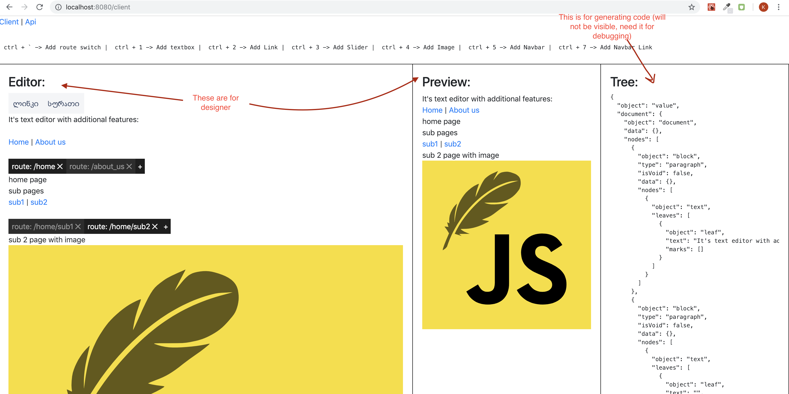

**Start developing not from 0 but from wireframes**

Motivation for this project is to use wireframes for generating code. This is text editor plus tools to assemble website or separate components, preview result and generate code.

There are 3 views:

- Editor - where you assemble component
- Preview - live preview of changes
- Tree - where you see json representation of what you assembled in editor (this information is used to generate code based on whatever framework you like (react, angular...), Preview for example is built with tree using react)

The idea is that we don’t build website with tree information, instead we generate code, because you can’t predict all logic that can be required on page, this custom logic can be added by developer.

**Components**

You should be able to add button, textbox, dropdown, table (you should be able to import existing components easily from other frameworks)… like we added image, editor will have toolbox like google docs has.

**Practical usage**

You can build a website from scratch or single component. For example we now need all devices list in dashboard. Designer could build only this page, drop a table, configure this table’s columns in properties editor and finally build it. Output will be AllDeviceListPage.tsx (if you choose react). Developer could continue from this point.

**Note!**

I made this project when learning about slatejs framework which allows you to build custom text editor (switched from using draftjs). Project is immature, it shall have many components to add and configure, but now has only image, textbox, router, slider…
